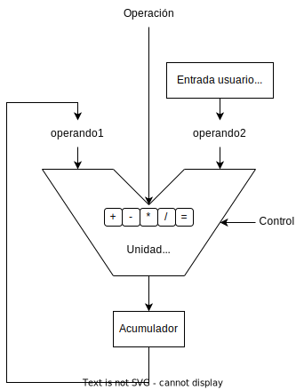
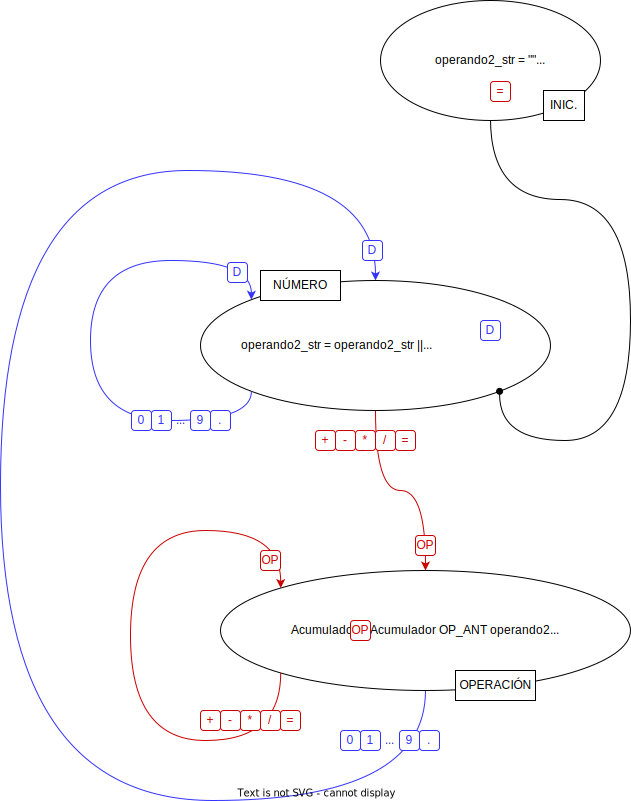
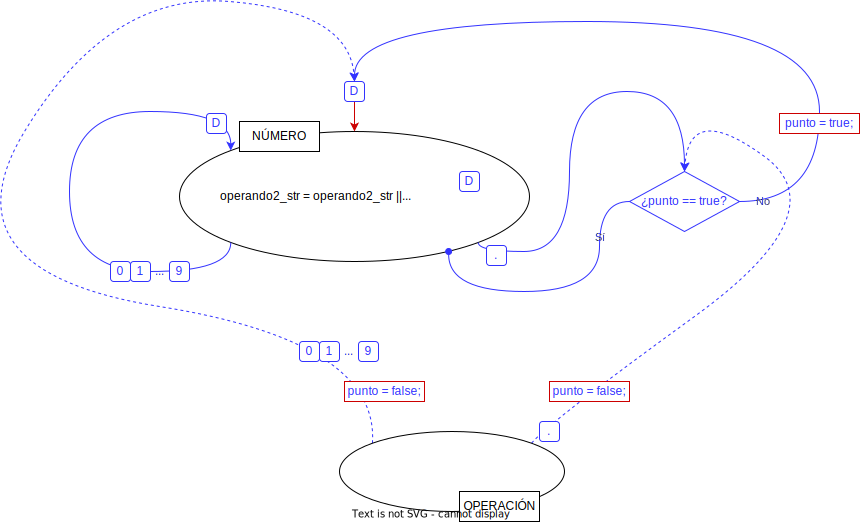

<!-- markdownlint-disable MD033 -->


<div style="background-color:white; color:black">

<h3 align="center">Aplicaciones y Usabilidad</h3>


<h1 align="center"><b>Calculadora en Android</b></h1>
<h3 align="center"><b>Práctica</b></h3>
<h2 align="center"><b></b></h2>

<h4 align="center"><b>A. Alcaraz Bellido</b><br>
<b>F. J. Martínez Zaldívar</b></h4>

<h3 align="center">Grado en Tecnología Digital y Multimedia</h3>
<h3 align="center">ETSIT-UPV</h3>


# 1. Introducción y objetivos

Con esta práctica  se pretende que el alumno se familiarice con
aspectos básicos de la programación en Android como son el diseño de
actividades sencillas, interacción con la interfaz gráfica, utilización
de distintas fuentes de texto, logos de la aplicación, uso de algunas
clases específicas de Android, etc.

Para ello se plantea como objetivo diseñar una aplicación Android que
consista en una sencilla calculadora con las cuatro operaciones básicas:
suma, resta, multiplicación y división, y alguna que otra funcionalidad sencilla adicional.

Se va a proporcionar una solución mínimamente operativa, e incluso el _layout_ de
los elementos *view* de los que consta la aplicación, y se va a dar una serie de directrices para llegar a una solución más completa. Esto no impedirá que haya una completa
libertad en cuanto al diseño o rediseño de dicha aplicación.

Queda a la entera libertad del alumno o grupo el ampliar las características de la calculadora,
añadiendo funciones más complejas como funciones transcendentes,
manejo de paréntesis, memoria, etc., de manera completamente voluntaria.


# 2. Funcionalidad de la calculadora

La funcionalidad  a conseguir es la de una calculadora sencilla y
convencional sin grandes pretensiones. Las características deberían ser las siguientes:

- Introducción de números enteros o decimales en coma fija (sin
    notación exponencial): internamente, dentro de la aplicación, el
    tipo a emplear que represente a los operandos o resultados, se
    sugiere que sea `double`, y no `float`, para tener una mayor precisión
    en los cálculos.

- Operaciones **generales**:
  - Operaciones binarias (dos operandos: `operando1` y `operando2`): suma (`+`), resta (`-`), multiplicación (`*`) y división (`/`)
  - Operación resultado o igualdad: evaluación del resultado (`=`)

- Operación unaria (un operando): cambio de signo (`+/-`)
- Operación de borrado (`C`, con el que se borra el operando
    actual pudiendo escribir uno nuevo) y si se pulsa dos veces se
    cancela además la operación pendiente y se inicializa la calculadora.


- Por simplicidad, no se considerará  diferencia en la precedencia de operadores, por lo que la evaluación siempre será de izquierda a derecha independientemente del operador. Es decir:

  ```text
  4.2 + 3.8 * 1.2 / 3.0 - 0.1 =
  ``` 

  se evaluará como:

  ```
  ((((4.2 + 3.8) * 1.2) / 3.0) - 0.1) = 3.1
  ```


Hay infinidad de formas de abordar el problema. Desde un punto de vista abstracto, se sugiere que se emplee
un *acumulador* en el que se guardará el resultado de las
operaciones y además se reutilizará como `operando1` en las operaciones
binarias subsiguientes junto con el `operando2` introducido por el usuario, tal y como muestra la siguiente figura:


<div id="fig:ALU">
<p align="center"><br/>

</p>
<p align="center"><b>Figura 1</b>: unidad aritmética basada en acumulador</p><br/>
</div>

En la figura anterior aparece también una línea denotada con `Operación` donde de forma simbólica se especifica el tipo de operación **general** a realizar: suma, resta, multiplicación, división y resultado,  y con `Control` una línea que, como se observará más adelante, permite controlar temporalmente cuándo hacer la operación `Operación` entre los operandos `operando1` y `operando2` y cargar el resultado en el `acumulador`.


## 2.1. Estrategia algorítmica inicial

A continuación se muestra una serie de sugerencias para abordar una primera aproximación a la solución del problema; además se proporciona en una plantilla de proyecto Android una propuesta provisional y mínimamente operativa con la que empezar a trabajar. Se propone que:

- La calculadora esté basada en un `acumulador` tal y como se ha descrito anteriormente, interpretado como un almacenamiento temporal donde se guarda el resultado de la operación y se reaprovecha como _primer_ operando u `operando1` para la siguiente operación.


- El _segundo_ operando, `operando2` será siempre introducido por el usuario mediante el teclado.
> Téngase en cuenta que el `operando2` se formará a
partir de la interacción del usuario con el teclado de la calculadora pulsando las teclas correspondientes a los dígitos y
potencialmente el punto decimal. (Se sugiere que se estudie el ejemplo de partida proporcionado en este repositorio, para entender cómo se va formando el número a partir de la pulsación de las teclas oportunas.)


Asi pues, sirva el siguiente ejemplo gráfico como modelo a seguir, pretendiendo hacer la secuencia de operaciones aritméticas:

```text
4.2 + 3.8 * 1.2 / 3.0 - 0.1 =
``` 

<div id="fig:operaciones">
<p align="center"><br/>

</p>
<p align="center"><b>Figura 2</b>: ejemplo de interacción</p><br/>
</div>


En esta  [figura 2](#fig:operaciones) se muestra la mecánica de las operaciones de forma regular, de modo que obviando la situación inicial que se comentará posteriormente, se observa que siempre se lleva a cabo el siguiente proceso de forma sistemática:

- En la [figura 2](#fig:operaciones) aparecen numerosos acumuladores y unidades aritméticas: en la realidad solo habrá un acumulador y una unidad aritmética reutilizadas iterativamente.
- El `operando1` de cualquier operación será **siempre** el `acumulador`
- El `operando2` de cualquier operación será **siempre** introducido por el usuario
  - El `operando2` estará definitivamente delimitado cuando se pulsa una tecla de operación **general** y no antes.
    - **Importante**: cuando se pulsa una tecla de operación **general**, entonces se **ejecuta** la `operación_anterior` entre el `operando1` (`acumulador`) y el `operando2` (recientemente introducido por el usuario), quedando por tanto pendiente la ejecución de la operación recientemente introducida (obsérvese en el gráfico); es por ello que aparece una conexión de _control_ discontinua entre la tecla de operación general y la unidad aritmética correspondiente a la operación anterior.

  > Debemos insistir en que el `operando2` queda conformado definitivamente cuando es delimitados por un operador **general**; por ejemplo, en la secuencia `4.2+3.8*...`, la presencia del  operador general `*` delimita la conformación o finalización de la introducción por parte del usuario del operando `3.8`, y **no antes** pues no se sabe cuándo acaba de introducirse un operando hasta que aparece un signo de operación u operador general. Por lo tanto, es cuando aparece `*` y **no antes**  cuando se puede llevar a cabo el cálculo `4.2+3.8` pues el operando `3.8` se ha estado formando hasta que definitivamente ha aparecido el operador general `*`, de modo que podemos decir que en tal caso, la operación general `+` **era** una `operacion_anterior` pendiente de ejecución, la cual, tras ser ejecutada tras la aparición de `*`,  provoca que ahora `*` sea entonces la _nueva_ `operacion_anterior` pendiente de ser ejecutada en el futuro.


Con la intención de _regularizar_ todo el proceso, hemos tenido que artificiosamente hacer una primera operación `inicial` equivalente a _cargar el `acumulador`_ con el operando proporcionado por el usuario tal y como se observa en la figura anterior (carga de valor `4.2` en `acumulador`). Habría muchas formas de conseguirlo: ajustando el `acumulador` a 0 y poniendo como operación `inicial` una operación suma (o un 1 en el `acumulador` y operación `inicial` una multiplicación...). En el ejemplo de la [figura 2](#fig:operaciones) se ha optado como operación `inicial` entre el `operando1` (`acumulador`) y el `operando2` ejecutar la simple selección del `operando2` (por lo que ni siquiera sería necesario inicializar el `acumulador`), pero inistimos en que cualquiera de las anteriormente comentadas habría sido perfectamente correcta. Repetimos que este _artificio_ se ha llevado a cabo para intentar ser lo más regular posible en todas las operaciones.

**Un úiltimo detalle**: la visualización de los resultados. Siguiendo la operativa de cualquier calculadora convencional, cuando se pulsa una tecla correspondiente a una operación, se  visualiza automática e inmediatamente el resultado de la `operación_anterior`, guardado consecuentemente en el `acumulador`. Por otro lado, nada más que se pulsa una tecla correspondiente al primer dígito (o punto decimal) de un nuevo `operando2`, entonces se escribe y actualiza dicho `operando2` en la pantalla, abandonando por tanto la visualización del `acumulador`. Por lo tanto la estrategia de visualización se centra en dos eventos:
- Tras pulsar cualquier tecla de operación: el valor del `acumulador` que contiene el resultado de la  `operacion_anterior` se debe visualizar en la pantalla o _display_ de la calculadora.
- Tras pulsar cualquier dígito o punto decimal, el valor del `operando2` que se está formando debe ser visualizado en la pantalla o _display_ de la calculadora.


Con todas estas consideraciones, podríamos acercarnos a una primera aproximación de una posible solución del problema si planteamos el siguiente diagrama de estados provisional:

<div id="fig:diagEstados">
<p align="center"><br/>

</p>
<p align="center"><b>Figura 3</b>: diagrama de estados</p><br/>
</div>

cuya explicación viene a continuación.

En el diagrama observamos tres estados principales:
- **INIC.**: es un estado inicial y transitorio pues se hacen ciertas operaciones de inicialización y de forma automática se pasa al estado **NÚMERO**. Ya no se vuelve a él hasta que arranque de nuevo el programa o se requiera una _reinicialización_ mediante cierta combinación de teclas.

  El diagrama de estados pretende corresponderse con el funcionamiento de la plantilla de código Android proporcionada, luego conviene tener un buen entendimiento del mismo: 
    - `operando2_str` es el `String` Java que se va formando al ir acumulando las teclas pulsadas por el usuario correspondientes a los dígitos decimales y el signo de puntuación. Inicialmente será un _string_ vacío.
    - `operando2` será la versión `double` del string `operando2_str` interpretado este como un número 
    - `Acumulador` es el `double` que almacenará el resultado de la operación aritmética.
    - `OP_ANT` representa simbólicamente la `operación_anterior` que queda pendiente por realizar ya que se está esperando a que se conforme definitivamente el segundo operando. Inicialmente se establece como `=` ya que convendrá por simplicidad algorítmica, aunque ello requiere definir muy bien el comportamiento de esta operación.

- **NÚMERO**: llegamos a este estado automáticamente desde **INIC.** o bien desde el estado **OPERACIÓN** o permanecemos al pulsar las teclas correspondientes a los dígitos 0..9 o el punto decimal (todo ello indicado con  color azul). Recuérdese que mientras se va formando el número, se va mostrando el mismo en pantalla. 
    - La transición que da lugar a la (re)entrada en el estado **NÚMERO** viene dada por un dígito o punto decimal, denotado genéricamente por la letra `D` recuadrada. El carácter correspondiente a dicho dígito o punto decimal se concatena con los que ya se han concatenado previamente (indicado con la operación `operando2_str = operando2_str || D)`; obsérvese en el código Java que esa concatenación acumulativa de `Strings` se realiza con el operador `+=`.
    - El _String_ actualizado se visualiza en la pantalla de la calculadora (denotado por `Display(operando2_str)`; en el código Java ejemplo suministrado se apreciará de manera distinta: empleando el método `.setText(operando2_str)` de un objeto `TextView`)
    - Se obtiene una representación numérica del número codificado en el _string_ `operando2_str` en la variable `operando2` mediante el método suministrado `miStringToDouble`.

- **OPERACIÓN**: llegamos a este estado desde el estado **NÚMERO** o seguiremos en el mismo al pulsar las teclas correspondientes a las operaciones generales (`+`, `-`, `*`, `/`, `=`), indicado con color rojo. Al introducirnos en este estado, ejecutaremos la operación **pendiente** anterior, denotada en el diagrama de estados por `OP_ANT`, entre el `operando1` (`acumulador`) y el `operando2`,  y guardaremos dicho resultado en el `acumulador`, mostrándolo en la pantalla. También guardaremos la operación que ha provocado la transición como siguiente operación **pendiente** u `OP_ANT` (u `operacion_anterior` en el texto de esta memoria).


Un último comentario: la operación `=` realmente ha quedado algo difusa en cuanto a su funcionalidad; dejaremos para un poco más adelante su mayor concreción.


Toda esta  operativa o descripción algorítmica no proporciona todavía un resultado correcto como se podrá comprobar a continuación, pero su entendimiento es un primer paso para ir perfeccionando todo el software y llegue a ser completamente operativo. 

## 3. Clonación

En el contexto en el que se va a trabajar, tanto el presente enunciado que se está leyendo como el proyecto Android completo pueden clonarse bien de forma convencional en una ventana de línea de comandos mediante la instrucción `git clone <URL> <DIR_LOCAL>`, bien utilizando las utilidades Git que tiene ya integradas el propio IDE Android Studio, tal y como muestra la [figura 4](#fig:clon)


<div id="fig:clon">
<p align="center"><br/>

</p>
<p align="center"><b>Figura 4</b>: clonación de un proyecto Android</p><br/>
</div>

Por lo tanto, el alumno puede escoger la opción que prefiera para ello. Si elige la opción de clonación a través de Android Studio, y es la primera vez que lo hace, tendrá muy probablemente que autenticarse de nuevo mediante un nuevo PAT (Personal Access Token); recuérdese que es una contraseña distinta a la exigida cuando se accede a GitHub mediante un navegador.

Si no hay problemas durante la clonación, debería aparecer una ventana de Android Studio con el proyecto de la calculadora con cierta parte del código ya proporcionado, tal y como muestra la siguiente [figura 5](#fig:trasClon)


<div id="fig:trasClon">
<p align="center"><br/>

</p>
<p align="center"><b>Figura 5</b>: proyecto inicial tras clonación</p><br/>
</div>

Como se podrá observar, el fichero `MainActivity.java` está rellenado de forma provisional con un código operativo aunque con deficiencias que se irán resolviendo poco a poco. Este código se corresponde de manera bastante aproximada al del diagrama de estados de la [figura 3](#fig:diagEstados).


## 3.1 Ejecución de la solución provisional dada


Tras comprender la primera aproximación a la solución expuesta en los apartados anteriores, contrastando el diagrama de estados con el código Java, se propone que se arranque el proyecto Android proporcionado en este mismo repositorio para realizar ciertas verificaciones así como algunas modificaciones.

Se propone que se arranque en un emulador o en un terminal real el código proporcionado para verificar que funciona acorde con la especificación dada en el diagrama de estados. 

## 3.2. Primeras modificaciones en el código

El fichero `activity_main.xml` está ya relleno con unos elementos `View` que conforman un _display_ o visor y un teclado de calculadora, que en cualquier caso, puede ser modificable por el alumno. Los estilos por defecto cambian de versión a versión, por lo que es probable que se encuentre con un *layout* con botones muy cercanos entre ellos, por lo que se sugiere, en tal caso, que se aumente la separación, por ejemplo con un atributo `android:layout_margin="4dp"`; asimismo, también se sugiere que se cambie el color del botón si no es del gusto del alumno (véase las figuras [6](#fig:layout) y [7](#fig:layout2)).

<div id="fig:layout">
<p align="center"><br/>

</p>
<p align="center"><b>Figura 6</b>: layout inicial</p><br/>
</div>

<div id="fig:layout2">
<p align="center"><br/>

</p>
<p align="center"><b>Figura 7</b>: layout definitivo, separación y colores </p><br/>
</div>


<div id="fig:calc">
<p align="center"><br/>

</p>
<p align="center"><b>Figura 8</b>: aspecto de la calculadora en el emulador </p><br/>
</div>


Si se observa el
fichero `activity_main.xml`, en el que ya está creada toda una propuesta
de *layout*, todas las *teclas* tienen un atributo `android:id` que
permite identificarlas y además otro atributo `android:onClick` cuyo
valor es `"alPulsarTecla"` lo que indica que el método
`public void alPulsarTecla(View tecla){…}` será el invocado cuando cliquemos
cualquier objeto `View` cuya propiedad `android:onClick` tenga el valor citado. Por lo tanto, el tratamiento de la interacción y la
discriminación sobre qué tecla fue la clicada debería realizarse en el citado método `alPulsarTecla`, tal y como se muestra en la plantilla de la solución.


También debería observarse en el código Java de qué manera se averigua cuál fue la tecla pulsada: podría haberse empleado un retorcido esquema de tipo `if ( idDeTecla == idTecla_0) { ... } else if ( idDeTecla == idTecla_1 ) { ... } ...` lo cual habría sido tremendamente engorroso. Además, el tratamiento requerido para ciertos conjuntos de teclas, es prácticamente el mismo.
Bien, pues aprovechando esta coyuntura, en el ejemplo solución provisional proporcionado se ha utilizado un esquema `switch()` que el alumno debería entender para poder apreciar de qué forma se ha tratado de simplificar el software.


# 4. Mejoras en el código: detalles de la aplicación

A continuación se proponen una serie de mejoras que tratarán de obtener una aplicación más robusta y más parecida a la de una calculadora convencional. Este es realmente el cometido principal de la práctica y por lo tanto debe resolverse de la mejor manera posible.

## 4.1. Control de la orientación 

Podrá comprobarse fácilmente que si se gira el terminal estando a medias de realización de una serie de cálculos, se reinicia la aplicación. Para evitar, de momento ese problema, considérese sólo un
funcionamiento con orientación vertical o `portrait`. Podemos fijar  una orientación vertical exclusivamente para nuestra aplicación calculadora con la instrucción
```java
setRequestedOrientation(ActivityInfo.SCREEN_ORIENTATION_PORTRAIT);
```

tras `setContentView(...);`, dentro del método `onCreate(...){ ... }`.

## 4.2. Control del punto decimal

Se sugiere que se introduzca un número introduciendo dos puntos decimales; podrá observarse cómo la aplicación deja de funcionar. Búsquese la línea en la que se produce el colapso de la aplicación y el motivo real por el que este error ocurre.

Evidentemente el motivo es que un número sintácticamente correcto no puede tener más de un punto decimal. 
Se sugiere un cambio en el comportamiento del algoritmo para poder controlar la presencia de dos o más puntos decimales en la formación de un número.  La figura siguiente muestra una sugerencia:


<div id="fig:punto">
<p align="center"><br/>

</p>
<p align="center"><b>Figura 9</b>: control del punto decimal </p><br/>
</div>

Si en algún momento, `punto=true` es porque en el número ya hay un punto decimal.
Téngase en cuenta que esto es solo una sugerencia y no significa que el código deba ser un fiel reflejo; por ejemplo, la instrucción `punto = false;` se muestra al salir del estado `OPERACION` por pulsar una tecla correspondiente a un dígito o punto decimal, pero dicha instrucción se puede ejecutar alternativamente: no al salir del estado `OPERACIÓN`, sino al entrar, ya que tendrá idéntico efecto. Estas estrategias de programación se dejan al criterio del alumno. Un detalle adicional: la instrucción `punto = false;` también debería ejecutarse en el estado **INIC.**.

Añádase el código que sea necesario para que si un número es de la forma `0.XYZ...`, pueda introducirse como `.XYZ...`.


## 4.3. Operativa de  `=`

El signo `=` correspondiente a la operación **general** _resultado_ puede tener unos matices operacionales dignos de una pequeña reflexión previa: tras clicar el signo igual, al igual que con el resto de operaciones generales, se realiza la `operacion_anterior` mostrando en pantalla el resultado del `acumulador`. La casuística que nos podemos plantear a partir de ese instante es la siguiente:

1. Después del `=` introducimos un nuevo operador cuya intención será operar el contenido del `acumulador` con el del futuro `operando2` a introducir por el usuario.

2. Después del `=` introducimos un nuevo número, olvidándonos de todo lo anterior. Este número hará las veces de operando 1, por lo que debería ir directamente al `acumulador`, como si fuera la situación inicial de funcionamiento de la calculadora.

3. Dos `=` consecutivos, siendo entonces la intención mostrar el contenido del `acumulador` sin hacer ningún tipo de operación con el mismo

Estas situaciones se presentan gráficamente en la figura siguiente con las leyendas respectivas **caso 1.**, **caso 2.** y **case 3.** respectivamente.


<div id="fig:igual">
<p align="center"><br/>

</p>
<p align="center"><b>Figura 10</b>: comportamiento para <code>=</code> </p><br/>
</div>


La conclusión es obvia y bastante útil ya que hemos deducido a partir de la casuística planteada cuál debería ser la algorítmica del operador `=`, ya que su funcionalidad depende de lo que haya entre `=` y la siguiente operación general:
- Si no hay nada, es decir, si tras `=` viene una operación general, entonces el _resultado_ de la operación `=` es el `operando1`, es decir, el propio `acumulador` (**caso 1.**).
- Si hay un número entre `=` y el siguiente operador, el _resultado_ de la operación `=` es el `operando2` (**caso 2.**).
- Dos (o más) `=` consecutivos (**caso 3.**) encaja con el comportamiento del **caso 1.**

Podemos tener una visión alternativa: el funcionamiento de la `operación_anterior` `=` es `operando2` si el estado anterior fue **NÚMERO**; en caso contrario, simplemente no es necesario hacer nada (ya que el resultado es el propio `acumulador`). Modifíquese el comportamiento de la operación `=` en el código Java según este último comentario, comprobando que funciona igual que con la definición que venía ya en el código.


## 4.4. Cambio de operación aritmética

Si en un momento dado, si se ha pulsado cualquier tecla de una operación general binaria (`+`, `-`, `*` o `/`) y se vuelve a pulsar de nuevo otra (`+`, `-`, `*` o `/`, igual o distinta a la anterior) entonces simplemente se cancelará la `operación_anterior` por la nueva sin más consecuencias. Es decir, si se pulsan consecutivamente 2 o más teclas correspondientes a una operación aritmética binaria general, se tendrá en cuenta solo la última.

## 4.5. Cambio de signo `+/-`

La operativa del cambio de signo puede entenderse como dual en función del estado en el que estemos:

- Si estamos en el estado **NÚMERO**, entonces deberíamos cambiarle el signo al `operador2` y consecuentemente mostrar el _nuevo valor_ en el display.
- Si estamos en el estado **OPERACIÓN** entonces deberíamos cambiarle el signo al ``acumulador`` y consecuentemente mostrar el _nuevo valor_ en el display.


La pulsación de esta tecla no debe cambiar el estado en el que se está.


## 4.6. Valor inicial del display


 El valor textual inicial del `TextView` que representa la pantalla
    de la calculadora (con `android:id="display"` es un `String` cuya inicialización XML es
    `android:text="0."`; la intención es cambiar ese *String* `"0."` por
    un recurso de tipo `String` que se denomine `cero`.


## 4.7. Tecla `C` _(clear)_

La operativa de la tecla `C` o función _clear_ depende del contexto:

- Si estamos en el estado **NÚMERO**, entonces deberían _inicializarse_ tanto `operando2_str` como `operando2`, mostrando el valor del recurso String `cero`; si se vuelve a pulsar una segunda vez consecutiva, entonces se debe volver al estado **INIC.**

- Si estamos en el estado **OPERACIÓN**, entonces se vuelve al estado **INIC.**


## 4.8. Fuente del <em>display</em>

Vamos a intentar cambiar la fuente del _display_ de la calculadora, es decir la fuente con la que se escriben los números y resultados de las operaciones en la pantalla.

 Es muy sencillo trabajar con una fuente
    adicional en nuestra aplicación. Los pasos a seguir podrían ser los
    siguientes:

  - Descargar la fuente:

    - Se sugiere que del sitio web [`https://fonts.google.com/`](https://fonts.google.com/) se busque y se descargue la fuente **Orbitron** (o cualquier otra que al alumno le guste y que sea gratuita).

    - Descárguese la familia completa (`Download family`, en la esquina superior derecha): fichero `zip`.

  - Introducirla en el proyecto:

    Descomprímase el fichero `.zip` y cópiese, por ejemplo, el
    fichero denominado `Orbitron-VariableFont_wght.ttf` (la
    extensión `.ttf` denota *true type font*, que son fuentes
    escalables) y llévese a la carpeta `font` dentro de la carpeta
    `res` de Android Studio. Si no aparece la subcarpeta `font`, se
    puede forzar a que se muestre creando un recurso de tipo *font*.
    Para ello:

    - `File`&#x2192;`New`&#x2192;`Android Resource File`

    - En la ventana que aparece, introdúzcase

      - Un nombre arbitrario de fichero (`fuentes`, por ejemplo): `File name: fuentes`

      - Y un tipo de recursos _font_: `Resource type: font`

      - Pulsad OK 

      Con lo que ya se debería mostrar la carpeta `font` bajo `res` en
      la que deberíamos copiar el citado fichero `.ttf` (`CTRL-C`&#x2192;`CTRL-V`). Deberíamos considerar modificar el
      nombre del fichero `.ttf` (o _refactorizar_) ya que, para los nombres de los
      recursos solo se admiten letras minúsculas, números y el
      carácter de subrayado.

    - Referenciarla: en el elemento XML `TextView` que contiene el
        _display_, añádase el atributo

        `android:fontFamily="@font/<NOMBRE_DE_LA_FUENTE>"`,

        donde `<NOMBRE_DE_LA_FUENTE>` es el nombre definitivo con el que
        finalmente aparece el recurso `.ttf` bajo la carpeta `font`.

    De esta manera conseguiremos que el número escrito en la pantalla,
    aparezca con la fuente indicada, tal y como se muestra en la app
    ejemplo o en la [figura 8](#fig:calc).


## 4.9. Conversión de formatos y formato del número en la pantalla.

Evidentemente, cuando se deseen hacer cálculos aritméticos, el formato de las variables implicadas debe ser numérico y más concretamente `double` para minimizar la pérdida de precisión. Pero si se está _formando_ el número, acumulando los caracteres correspondientes a los dígitos o cuando un valor numérico se desea que se escriba en pantalla, la información debe estar codificada esta vez en una varibale de tipo `String`.  Consecuentemente, durante la ejecución del programa, vamos a estar cambiando de formatos en un sentido y en otro. 


Para obtener una variable de tipo `double` a partir de un `String` lo más sencillo es emplear el método estático 

```java
double x = Double.parseDouble("-1.234");
```

tomando todas las precauciones y controles posibles para evitar una excepción que arruine el programa por un formato numérico incorrecto en el _string_.

En el sentido opuesto, es decir, para convertir un `double` en un `String`, por ejemplo, para escribirlo en un elemento de la clase `TextView`,
puede simplemente convertirse a `String` con una simple concatenación con la cadena vacía:

```java
TextView display; 
double numero;
...
display.setText(""+numero)
```

Pero podremos comprobar cómo por cuestiones del error de redondeo
por la precisión finita de los números en coma flotante, aparecen de
vez en cuando, decimales que nos gustaría eliminar o redondear. La clase
`java.text.DecimalFormat` nos puede ser de gran utilidad. Por
ejemplo:

```java
TextView display; 
double numero;
...
DecimalFormat df = new DecimalFormat("#.#############");
display.setText(df.format(numero));
```

nos formateará el número en coma flotante con un máximo de 14
dígitos significativos (14 caracteres `#`), de una manera a la que
estamos más acostumbrados cuando interactuamos con una calculadora
convencional. (Búsquese más información sobre la clase
`java.text.DecimalFormat` y **no confundirla** con la clase
`android.icu.text.DecimalFormat` cuya funcionalidad es distinta).

En el código ejemplo, todas estas ideas se encierran en el método `miDoubleToString()`.


Ya se han proporcionado métodos para llevar a cabo estas transformaciones. Se sugiere que se estudie y se entienda su comportamiento.


## 4.10. Logo de la aplicación

Añádase un logo de aplicación y cámbiese el nombre de la misma:

  - Conviene tener varias versiones del fichero gráfico del logo, en función de la
    densidad de píxeles en la pantalla. Hay una herramienta que lo
    hace automáticamente: `File`&#x2192;`New`&#x2192;`Image Asset`. Para
    generalizar, se sugiere que se escoja un tipo de icono *Launcher
    Icons (Adaptive y Legacy)*. Se debe proporcionar un nombre y
    después elegir el icono (puede ser una imagen, un *clip art* o
    un texto); se sugiere que sea una imagen y que se especifique en
    el cajetín *Path*. A continuación con las opciones *Trim/resize*
    se ajusta el icono al área disponible y después se confirma todo
    lo que viene a continuación.

  - En el fichero `AndroidManifest.xml` (que puede localizarse en la subventana `Project`, visión `Android`, carpeta `app/manifests`) hay que indicar la nueva
    elección, editando el fichero, modificando los atributos `android:icon` y
    `android:roundIcon` al nombre del nuevo icono

  - El nombre de la aplicación puede modificarse en el fichero de
    recursos `strings.xml` (accesibe desde subventana `Project`, vision `Android`, carpeta `app/res/values`), editando 
    el elemento XML `string` cuyo atributo `name` es `"app_name"`.


## 4.11. Solución completa

Junto con la documentación de la práctica, se proporciona una solución completa de la práctica actual
en el fichero `doc/calculadora.apk` que es el ejecutable de la
aplicación. De modo que bien arrastrándolo al escritorio del terminal
virtual o bien haciéndolo llegar de alguna manera (por ejemplo mediante
Google Drive) al terminal real (probablemente, vía email será bloqueado
por sospecha de virus), podemos tener una posible solución al problema
planteado, para tomarlo como referencia. Esta calculadora no es fiable
ya que no ha sido verificada y muy probablemente tendrá fallos. Os
agradeceríamos que recopiláseis estos fallos y nos los hagáis llegar
para poder corregirlos.


## 4.12. Extensiones voluntarias


### Layouts

Se sugiere que se rediseñe un layout para la orientación
horizontal, apaisada o `landscape` y que se tenga en cuenta el
guardado y posterior recuperación del estado de la actividad
empleando oportunamente los métodos `onSaveInstanceState(…)` y
`onRestoreInstanceState(…)` u `onCreate(…)`. Para ello, habrá que
eliminar o comentar la instrucción que impedía que la interfaz gráfica de la
actividad girara con el cambio de orientación del móvil:

```java
//setRequestedOrientation(ActivityInfo.SCREEN_ORIENTATION_PORTRAIT);
```

En el nuevo *layout*, podría tenerse una disposición distinta a la
original: por ejemplo, teclado en la mitad derecha y número en la
izquierda, o como el alumno desee.

### Otras extensiones

Extensión de la funcionalidad: añadiendo funciones trascendentales, memoria, paréntesis, etc. Esto queda a libre elección del grupo.


# 5. Resultados a entregar

Debe actualizarse el proyecto Android del repositorio local en el remoto de GitHub. Esto puede llevarse a cabo mediante las herramientas gráficas de apoyo a Git que contiene Android Studio, o de manera convencional, en cualquier terminal tal y como se ha ido haciendo hasta ahora; terminal por cierto, que puede ser el que nos proporciona el propio Android Studio. Recuérdese que en cualquier caso, la mecánica consistía en añadir al *index* aquellos ficheros que se desee que formen parte del siguiente commit:

```bash
git add -A // se añadirían todos los ficheros nuevos, modificados y borrados de todo el directorio de trabajo
```

Creación de un commit:

```bash
git commit -m "Mensaje"
```

Esta operación add-commit puede realizarse cuantas veces lo considere oportuno cada integrante del grupo.
Se sugiere que se vayan realizando  regularmente *commits* para ir guardando en el
respositorio local las instantáneas del directorio de trabajo que os
parezcan oportunas, así como realizar una sincronización del repositorio
local con el remoto en GitHub, para salvaguardar una copia de seguridad
del repositorio en la nube; si se usaron nombres *estándar* para servidores y ramas una posibilidad es:

```bash
git push origin master
```


A lo largo del desarrollo de la práctica, el grupo es completamente
libre de actualizar el repositorio local o remoto como lo estime
oportuno, con las ramas o los *commits* que estimen necesarios, pero
respetando los *commits* y *tags* explicitados, como puntos de control. La forma de trabajar
se denomina genéricamente *workflow* y convendría aclararla antes de comenzar, es decir, repartir las tareas y utilizar las herramientas que el propio GitHub proporciona para llevar a cabo la comunicación entre los integrantes del grupo, como las *issues*. Se valorará que haya una intensa interacción con el repositorio remoto.


Si el grupo realiza  consultas a través de las *issues* de GitHub, recuérdese antes,
actualizar el repositorio remoto en GitHub e indicar como *assignees*
tanto al profesor como a todos los integrantes del grupo para que
lleguen notificaciones vía email de que hay una *issue* pendiente de ser
contestada.


Si se desea interactuar con GitHub en modo gráfico utilizando las facilidades que proporciona Android Studio, entonces primeramente hay que realizar un *commit* ([figura 11](#fig:commit1)):

<div id="fig:commit1">
<p align="center"><br/>

</p>
<p align="center"><b>Figura 11</b>: *commit* desde Android Studio (dos posibilidades)</p><br/>
</div>

tras lo cual, se mostrarán los ficheros que, en princpio, se mandarán al *index*, requieriendo la introducción del mensaje ([figura 12](#fig:commit2))


<div id="fig:commit2">
<p align="center"><br/>

</p>
<p align="center"><b>Figura 12</b>: adición al index y mensaje de commit</p><br/>
</div>

Cuando lo estimemos oportuno, los commits del repositorio local pueden subirse al repositorio remoto mediante una operación *push*, tal y como se puede observar en la [figura 13](#fig:push)

<div id="fig:push">
<p align="center"><br/>

</p>
<p align="center"><b>Figura 13</b>: push</p><br/>
</div>

## 5.1. Etiquetado

Cada alumno integrante del grupo deberá etiquetar individualmente tanto el último *commit* de su sesión de prácticas como el de la práctica en sí (si queda algún detalle pendiente, dentro de los tres días lectivos siguientes). Las etiquetas tendrán el formato `prN.sesion.fin.<USUARIO_DE_GITHUB>` y `prN.fin.<USUARIO_DE_GITHUB>` respectivamente, donde `N` denota el número de práctica. Estos *commits* deben estar ubicados obligatoriamente en la rama `master`.


Ello puede implicar que si los miembros del grupo hacen la práctica en la misma sesión y la finalizan en dicha sesión, el  *commit* en cuestión tendrá las 4 etiquetas. Si en ese mismo caso, quedan detalles pendientes por finalizar durante los tres siguientes días lectivos, cuando el considerado como último *commit* de la práctica esté en el repositorio, ambos alumnos etiquetarán dicho *commit*, a ser posible en el mismo instante.

Siguiendo con la casuística, si ambos miembros hacen la práctica en días distintos, entonces cada vez que un integrante finalice su sesión de prácticas, etiquetará su último *commit* con `pr3.sesion.fin.<USUARIO_DE_GITHUB>`. Cuando se dé la práctica por finalizada en cierto último *commit*, este deberá ser etiquetado por ambos con la etiqueta `prN.fin.<USUARIO_DE_GITHUB>`, a ser posible el mismo día.

Las etiquetas debe ponerlas cada alumno a título individual (un alumno no podrá etiquetar un *commit* por el otro, ya que la autoría de las etiquetas aparece reflejada en el repositorio). Ello obligará a que el alumno en cuestión tenga que tener sincronizado su repositorio local con el remoto en el momento de realizar el etiquetado.

**MUY IMPORTANTE**: se tiende a confundir mensajes de commit con etiquetas. Es decir, cuando se hace un commit, se añade un mensaje:

```bash
git commit -m "Mensaje"
```

`"Mensaje"` **NO** es la etiqueta del commit. Para etiquetar un commit, recuérdese que se debe emplear el comando `tag` oportunamente. Recuérdese que con 

```bash
git tag <ETIQUETA> <REFERENCIA>
```

Se etiqueta con el nombre `<ETIQUETA>` el *commit* cuyo hash, *commit* relativo a puntero o hash es `<REFERENCIA>`. Por ejemplo:

```bash
git tag prN.sesion.fin.fjmz-UPV master
```

etiqueta el commit apuntado por el puntero de rama `master` con la etiqueta `prN.sesion.fin.fjmz-UPV`.


Y con

```bash
git push origin --tags
```

se suben exclusivamente las etiquetas al repositorio remoto ubicado en el servidor `origin`.


Del mismo modo que se han creado commits y se han subido al repositorio remoto empleando las facilidades gráficas proporcionadas por Android Studio, así se puede hacer cuando se trabaja con las etiquetas. Hay que seleccionar el *commit* en cuestión y luego seleccionar la creación de una nueva etiqueta (véase la [figura 14](fig:etiquetado))


<div id="fig:etiquetado">
<p align="center"><br/>

</p>
<p align="center"><b>Figura 14</b>: etiquetado</p><br/>
</div>


Para subir las etiquetas creadas al repositorio remoto debe llevarse a cabo una operación *push* clicando explícitamente la opción *Push tags*, tal y como aparecía en la [figura 13](#fig:push).

</div>


