

  
<h1>GTDM Clicker</h1>

<h1>TRABAJO FINAL</h1> 

<h3>Aplicaciones y Usabilidad</h3>

<h4>
  Daniel Cabañero Martínez 
  Marcos Rome García 
  Javier Ruiz Ferrandis 
  Sara Oliete López 
</h4>

<h4>02 de Julio 2023</h4>

##

  
<h2>ÍNDICE</h2>

* [Manual de la App](#manual_app)
* [Interfaz](#interfaz)
* [Código](#codigo)
* [MainActivity](#mainactivity)
* [UpgradeActivity](#upgradeactivity)
* [Envío de datos](#envio_datos)
* [Conclusión](#conclusion)

##

<h2 id="manual_app">Manual de la App</h2>

Para el desarrollo de este proyecto hemos decidido diseñar una aplicación inspirada en los juegos "Clicker". En los cuales, el jugador tiene que aumentar su puntuación apretando un objeto en la pantalla. Con dicha puntuación, el jugador puede adquirir mejoras que le ayuden a conseguir los puntos en los clicks.

##

<h2 id="interfaz">Interfaz</h2>
La interfaz la hemos dividido en dos ventanas. Una donde está el logotipo de GTDM (el cual habrá que presionar) y dos botones: la mejora del icono y la tienda que en este caso se denomina "Inversiones". En la tienda, el jugador podrá acceder a esas mejoras que ayudarán a que el jugador pueda aumentar sus puntos.

  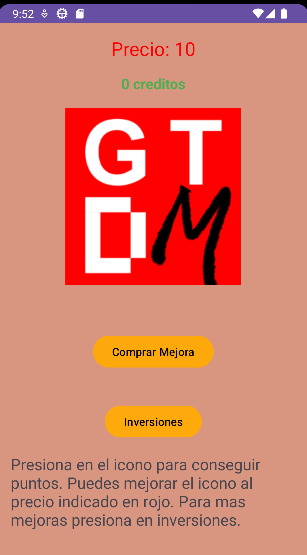 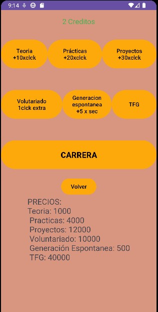

##

<h2 id="codigo">Código</h2>

<h3 id="mainactivity">MainActivity</h3>

La clase MainActivity almacena los clicks que el usuario le proporciona al pulsador. También imprime en dos TextView la puntuación (los clicks) y el mínimo de puntos que el jugador necesita para poder conseguir la mejora del multiplicador. Para ello hemos definido tres funciones: calcularCostoMejora(), actualizarContador() y actualizarPuntos().

  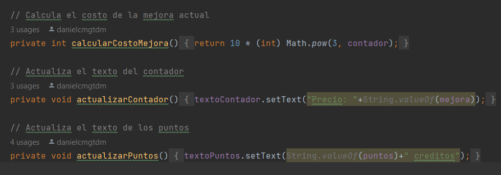

Por lo que hemos necesitado definir otros tres eventos: el primero, botonClick() el cual se encarga de ejecutar las funciones de actualizar puntos y contador. El segundo, un .setOnClickListener() para asignar directamente el evento al botón de la mejora. El cual comprueba los puntos que necesitas para obtener dicha mejora y los clicks que el jugador tiene acumulados. Si esos clicks acumulados son igual o mayor que los puntos necesarios, se aplica la mejora, se modifican esos puntos necesarios y se actualiza el contador de clicks. El tercer evento es el que iniciará la actividad de UpgradeActivity.java, que es la tienda.

##

<h3 id="upgradeactivity">UpgradeActivity</h3>

La clase UpgradeActivity es una actividad aparte que se puede acceder desde la actividad principal. Almacena los onclick que permiten al usuario mejorar su eficiencia al apretar la imagen.

En esta clase tenemos definidos ocho OnClick y dos TextView:

El primer OnClick está en el botón "Teoria". Cuando este se presione, se consigue que el usuario gane +10 créditos cada vez que este apriete el pulsador.

  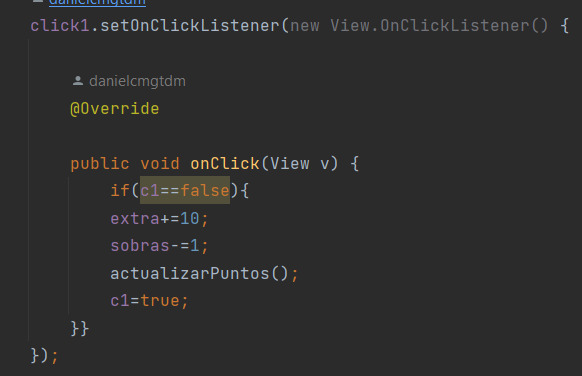

El segundo, es el botón "Practicas". El cual hace que, una vez haya sido presionado, el marcador suba +20 créditos cada vez que el usuario apriete el pulsador.

  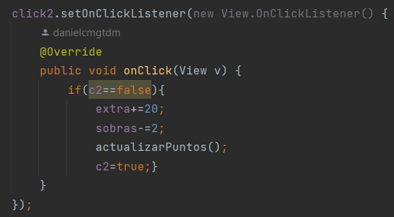

El botón "Proyecto" es el tercer OnClick. Y cuando es apretado hace que a partir de ese momento, cuando el usuario apriete el pulsador gane +30 créditos.

  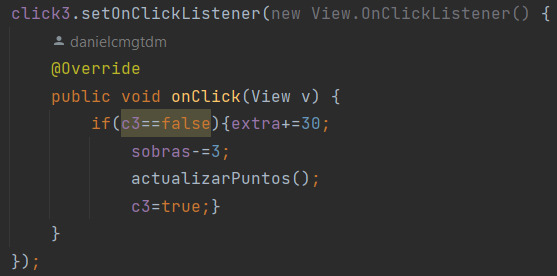

El cuarto OnClick es el botón "Voluntariado". Que al presionarlo bonifica al jugador multiplicando por dos la cantidad de puntos que gana cada vez que apriete el pulsador.

  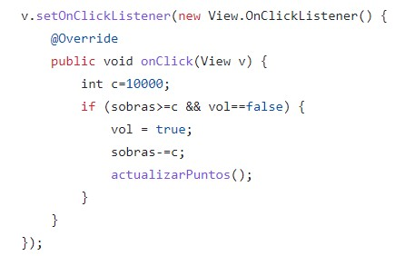

El quinto es el botón "GeneracionEspontanea". Para que cada segundo el usuario gane 5 crédito.

  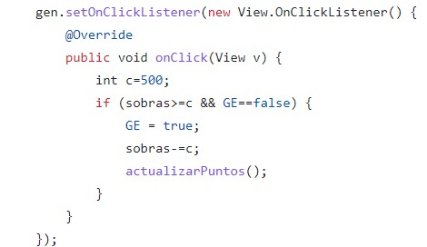

El botón "TFG" es el sexto OnClick. Cuando este botón se aprieta el juego termina.

  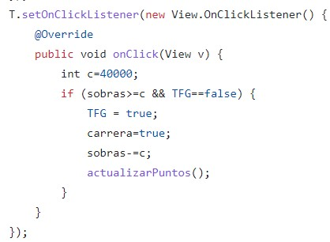

El séptimo es el botón "Carrera". Cuando es apretado el usuario sea llevado a una pantalla de fin.

  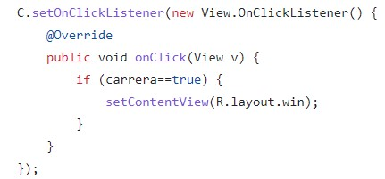

Por último, el octavo OnClick es el botón "botonVolver". Y se encarga de llevar al usuario a la "MainActivity".

  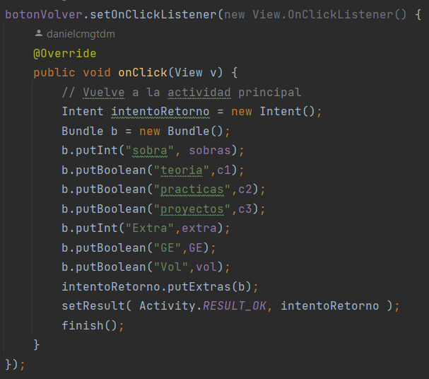

En cuanto a los TextView, el primero (ubicado arriba en la pantalla) indica cuántos créditos tiene el usuario.

Mientras que en el segundo (ubicado debajo del anterior) explicamos cómo funciona esta pantalla.

##

<h3 id="envio_datos">Envío de datos</h3>

Para que ambas actividades se comuniquen correctamente hacemos uso del lanzamiento de actividad con espera de resultado.
En nuestro caso tenemos todas las variables compartidas definidas en ambas actividades. Luego MainActivity llama a UpgradeActivity y le envía todos los valores de las variables con sus alias. Upgrade actualiza sus variables con los valores recibidos en su onCreate.
Una vez terminamos en Upgrade, al presionar “volver”, todos los valores se le envían a MainActivity como resultado y esta actualiza los suyos.

##

<h2 id="conclusion">Conclusión</h2>

Gracias a este proyecto hemos podido comprobar lo útil que es Android Studio para el diseño de aplicaciones y como hasta la aplicación más sencilla requiere una buena organización y bastante trabajo por detrás de lo que luego todos ven al abrir la app.

